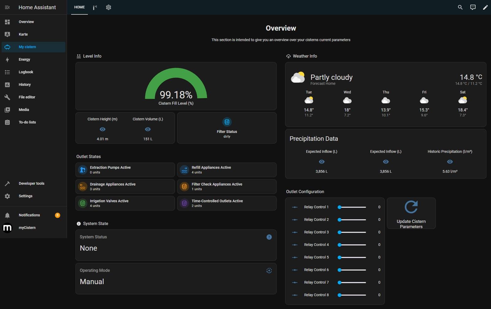
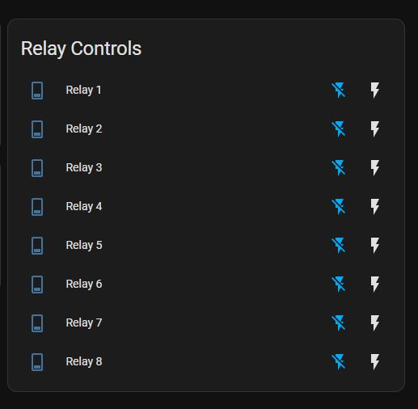
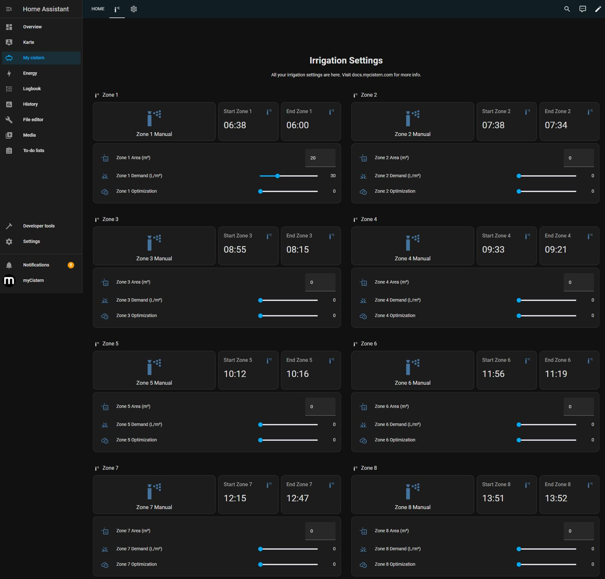
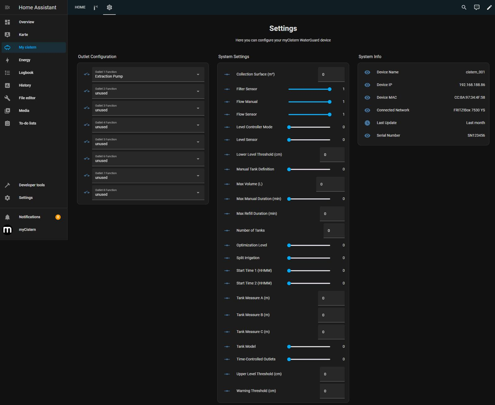

# Cistern Controller — Home Assistant Integration

[](https://www.home-assistant.io/)


I built this project to take full ownership of a cistern monitoring and control system — from the firmware running on an ESP32 all the way up to a custom Home Assistant integration and a Lovelace dashboard. The goal was a clean, self-hosted solution where I control every layer: what data gets exposed, how it's polled, and how the user interacts with it.

---

## What I Built

The core of this project is a custom `cistern` integration for Home Assistant. It connects to a cistern controller over the local network, reads live telemetry from a `/status` endpoint, and pushes configuration changes through `/command`. I wrote the integration from scratch using Home Assistant's coordinator pattern so state updates are efficient and the UI stays responsive.

On the firmware side, I wrote an ESP32 sketch that exposes the REST API the integration talks to. It generates realistic telemetry and accepts control commands, which makes the whole system easy to demo and develop against without needing a fully wired physical installation.

---

## Tech Stack

- **Python** — Home Assistant custom component
- **ESP32 / Arduino** — embedded firmware with REST API
- **REST / JSON** — client-device communication protocol
- **YAML** — Lovelace dashboard configuration
- **Home Assistant** — automation and UI platform

---

## Repository Structure

```text
custom_components/cistern/   Home Assistant integration (Python)
sketch_apr19a/               ESP32 firmware sketch (Arduino/C++)
examples/dashboard.yaml      Example Lovelace dashboard
assets/screenshots/          Dashboard and UI screenshots
```

---

## Integration Features

- **Zeroconf discovery** — the integration can find the device on the local network automatically
- **Coordinator-based polling** — efficient state updates without hammering the device
- **Sensor entities** — live telemetry and operating data
- **Switch entities** — relay and feature toggles
- **Number entities** — irrigation volume, tank thresholds, and timing settings
- **Time entities** — irrigation schedule configuration
- **Lovelace dashboard** — a ready-to-use frontend layout

---

## Setup

### Home Assistant

1. Copy `custom_components/cistern/` into your Home Assistant `config/custom_components/` directory.
2. Restart Home Assistant.
3. Add the integration from the UI — enter the ESP32 host and port if Zeroconf discovery doesn't find it automatically.

### ESP32 Firmware

1. Open `sketch_apr19a/secrets.example.h`.
2. Create `sketch_apr19a/secrets.h` with your Wi-Fi credentials.
3. Flash `sketch_apr19a/sketch_apr19a.ino` to an ESP32 board.

`secrets.h` is gitignored so credentials are never committed.

---

## Screenshots






---

## CI

A GitHub Actions workflow runs on every push and pull request to check the Python integration for syntax errors.
